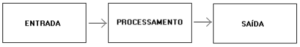

### Introdução à Programação

#### Introdução à Lógica de programação

**Prof.**: João Paulo Orlando

**Curso**: Bacharelado em Ciência da Computação

Para começar a aplicar lógica de programação, precisamos ter um problema a ser resolvido.

***\"Faça o caminho e me guie até o porco bobo!" Evite as TNTs ou penas irão voar!***

#### Lógica
A lógica de programação é necessária para pessoas que desejam trabalhar com desenvolvimento de sistemas e programas, ela permite definir a sequência lógica para o desenvolvimento.

Então o que é lógica?

**Lógica de programação é a técnica de encadear pensamentos para atingir determinado objetivo.**

Voltando ao nosso problema com porquinhos. **Quais passos o passarinho precisa fazer para alcançar o porquinho?**

#### Sequência Lógica

Estes pensamentos, podem ser descritos como uma sequência de instruções, que devem ser seguidas para se cumprir uma determinada tarefa.

**Sequência Lógica são passos executados até atingir um objetivo ou solução de um problema.**

Voltando ao nosso problema com porquinhos. **Qual das 4 sequencias lógicas alcançara o objetivo?**

#### Instruções

Na linguagem comum, entende-se por instruções “**um conjunto de regras ou normas definidas para a realização ou emprego de algo**”.

Em informática, porém, instrução é a informação que indica a um computador uma ação elementar a executar.
Convém ressaltar que uma ordem isolada não permite realizar o processo completo, para isso é necessário um conjunto de instruções colocadas em ordem sequencial lógica.

Por exemplo, se quisermos fazer uma omelete de batatas, precisaremos colocar em prática uma série de instruções: descascar as batatas, bater os ovos, fritar as batatas, etc.

É evidente que essas instruções têm que ser executadas em uma ordem adequada – não se pode descascar as batatas após fritá-las.
Dessa maneira, uma instrução tomada em separado não tem muito sentido; para obtermos o resultado, precisamos colocar em prática o conjunto de todas as instruções, na ordem correta.
**Instruções são um conjunto de regras ou normas definidas para a realização ou emprego de algo. Em informática, é o que indica a um computador uma ação elementar a executar.**

#### Algoritmo

Um algoritmo é formalmente uma sequência finita de passos que levam a execução de uma tarefa. Podemos pensar em algoritmo como uma receita, uma sequência de instruções que dão cabo de uma meta específica. Estas tarefas não podem ser redundantes nem subjetivas na sua definição, devem ser claras e precisas.

Como exemplos de algoritmos podemos citar os algoritmos das operações básicas (adição, multiplicação, divisão e subtração) de números reais decimais. Outros exemplos seriam os manuais de aparelhos eletrônicos, como um videocassete, que explicam passo-a-passo como, por exemplo, gravar um evento.

Até mesmo as coisas mais simples, podem ser descritas por sequências lógicas. Por exemplo:

*Chupar uma bala*
* Pegar a bala
* Retirar o papel
* Chupar a bala
* Jogar o papel no lixo

*Somar dois números quaisquer*

* Escreva o primeiro número no retângulo A
* Escreva o segundo número no retângulo B
* Some o número do retângulo A com número do retângulo B e coloque o resultado no retângulo C

#### Programas

Os programas de computadores nada mais são do que algoritmos escritos numa linguagem de computador (C, JavaScript, PHP, Python entre outras) e são interpretados e executados por uma máquina, no caso um computador. Notem que dada esta interpretação rigorosa, um programa é por natureza muito específico e rígido em relação aos algoritmos da realidade.

#### Desenvolvendo algoritmos - Pseudocódigo

Os algoritmos são descritos em uma linguagem chamada **pseudocódigo**. Este nome é uma alusão à posterior implementação em uma linguagem de programação. Por isso os algoritmos são independentes das linguagens de programação. Ao contrário de uma linguagem de programação, não existe um formalismo rígido de como deve ser escrito o algoritmo.

O algoritmo deve ser fácil de se interpretar e fácil de codificar. Ou seja, ele deve ser o intermediário entre a linguagem falada e a linguagem de programação.

#### Regras para construção do Algoritmo

Para escrever um algoritmo precisamos descrever a sequência de instruções, de maneira simples e objetiva. Para isso utilizaremos algumas técnicas:

* Usar somente um verbo por frase
* Imaginar que você está desenvolvendo um algoritmo para pessoas que não trabalham com informática
* Usar frases curtas e simples
* Ser objetivo
* Procurar usar palavras que não tenham sentido dúbio

#### Fases

Para montar um algoritmo adequado, primeiro precisamos dividir o problema apresentado em três fases fundamentais.

Onde temos:
* **ENTRADA**: São os dados de entrada do algoritmo
* **PROCESSAMENTO**: São os procedimentos utilizados para chegar ao resultado
* **SAÍDA**: São os dados já processados

Analogia com uma pessoa:

#### Exemplo de algoritmo

Imagine o seguinte problema: Calcular a média final dos alunos da 3ª Série. Os alunos realizarão quatro provas: P1, P2, P3 e P4.

Onde: Média Final = 

Para montar o algoritmo proposto, faremos três perguntas:

* Quais são os dados de entrada?

    R: Os dados de entrada são P1, P2, P3 e P4
* Qual será o processamento a ser utilizado?

    R: O procedimento será somar todos os dados de entrada e dividi-los por 4 (quatro)

* Quais serão os dados de saída?

    R: O dado de saída será a média final
    
Algoritmo
* Receba a nota da prova1
* Receba a nota de prova2
* Receba a nota de prova3
* Receba a nota da prova4
* Some todas as notas e divida o resultado por 4
* Mostre o resultado da divisão

#### Algoritmos podem ser aplicados para qualquer tarefa ou área

Vamos considerar o processo de decidir se uma pessoa deve ou não levar um guarda-chuva ao sair de casa, com base nas condições meteorológicas. 
Vamos chamá-lo de "Algoritmo de Decisão do Guarda-Chuva":

Algoritmo de Decisão do Guarda-Chuva:

1. Início:

    1.1. A pessoa acorda e se prepara para sair de casa.

2. Observação do Céu:

    2.1. Olhe pela janela e observe o céu.

3. Verificação de Condições Meteorológicas:

    3.1. Se estiver chovendo, vá para o passo 6.
    
    3.2. Se não estiver chovendo, vá para o passo 4.

4. Verificação de Previsão do Tempo:
    
    4.1. Confira a previsão do tempo para o dia.
    
    4.2. Se a previsão indicar chuva, vá para o passo 6.
    
    4.3 Se a previsão indicar tempo seco, vá para o passo 5.

5. Decisão Sem Guarda-Chuva:

    5.1. Como não está chovendo e a previsão é de tempo seco, a pessoa decide não levar um guarda-chuva.
    
    5.2. Fim do algoritmo.
    

6. Decisão Com Guarda-Chuva:

    6.1. Como está chovendo ou a previsão é de chuva, a pessoa decide levar um guarda-chuva.
    
    6.2. Fim do algoritmo.

Este é um exemplo básico de um algoritmo de decisão que uma pessoa pode seguir diariamente ao se deparar com a escolha de levar ou não um guarda-chuva. É uma sequência lógica de passos baseada em observações e condições meteorológicas para tomar uma decisão prática.

#### Outra forma de representar algoritmos - Diagrama de Bloco

O diagrama de blocos é uma forma padronizada e eficaz para representar os passos lógicos de um determinado processamento.

Com o diagrama podemos definir uma sequência de símbolos, com significado bem definido, portanto, sua principal função é a de facilitar a visualização dos passos de um processamento.

Existem diversos símbolos em um diagrama de bloco. Entretanto, segue os mais básicos:

| Símbolo | Função |
| :- | :- |
|  | Indica o INÍCIO ou FIM de um processamento. Exemplo: Início do algoritmo |
|  | Indica entrada de dados através do Teclado Exemplo: Digite a nota da prova 1 |
|  | Processamento em geral. Exemplo: Calculo de dois números |
|  | Mostra informações ou resultados Exemplo: Mostre o resultado do cálculo |

Dentro do símbolo sempre terá algo escrito, pois somente os símbolos não nos dizem nada. Veja no exemplo a seguir:

O que diagrama de bloco acima está representando?

#### Voltando ao algoritmo de cálculo da média

#### Demonstração de alguns algoritmos em blocos

Vamos montar alguns algoritmos utilizando blocos.

[https://studio.code.org/s/express-2021](https://studio.code.org/s/express-2021)