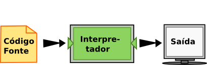
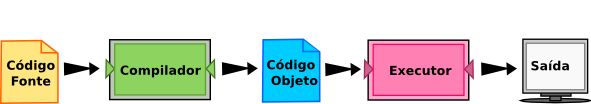
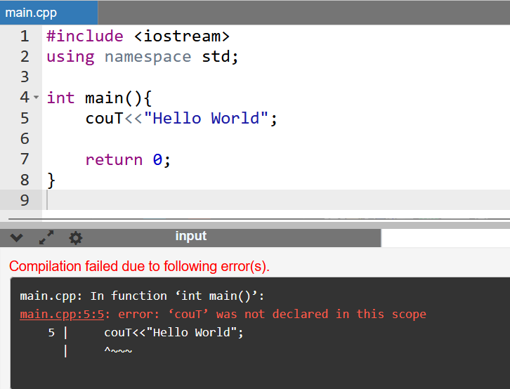
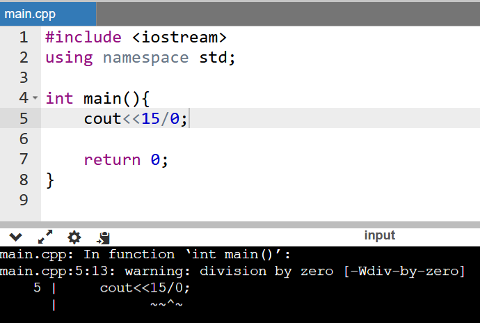
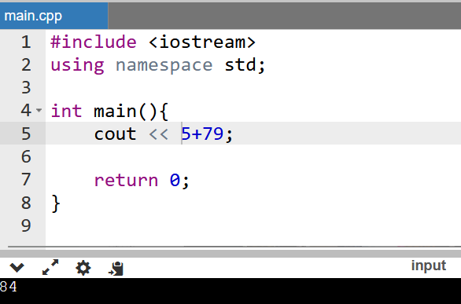
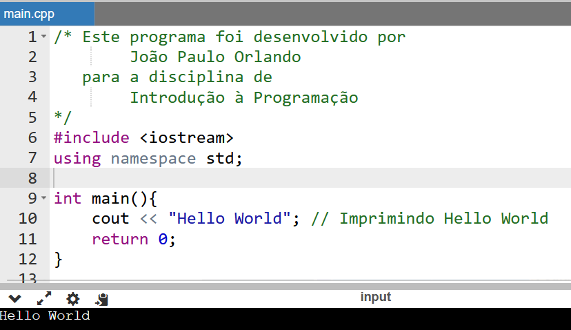

### Introdução à Programação

#### Introdução à Programação com C++

**Prof**: João Paulo Orlando

**Curso**: Bacharelado em Ciência da Computação

#### A linguagem de programação C++

**A linguagem de programação que você vai aprender é C++**. C++ é um exemplo de linguagem de programação de alto nível; outras linguagens de alto nível que você já pode ter ouvido falar são Python, PHP, Java e JavaScript.

Como você deve ter imaginado, existem também as linguagens de baixo nível, às vezes chamadas de “linguagens de máquina” ou “linguagens assembly” (“linguagens de montagem”). Dito de maneira simples, **o computador só consegue executar programas escritos em linguagens de baixo nível**. Deste modo, programas escritos em linguagens de alto nível precisam ser processados antes que possam rodar. Esse processamento extra toma algum tempo, o que é uma pequena desvantagem das linguagens de alto nível. Mas as vantagens são enormes.

Primeiro, é muito **mais fácil programar em uma linguagem de alto nível**. É mais rápido escrever programas em uma linguagem de alto nível; os programas ficam mais curtos, mais fáceis de ler, mais simples de alterar, e é provável que estejam corretos. 

Segundo, **as linguagens de alto nível são portáveis**, o que significa que podem rodar em diferentes tipos de computador, com pouca ou nenhuma modificação. Programas em baixo nível só podem rodar em um único tipo de computador e precisam ser re-escritos para rodar em outro tipo.

***Devido a essas vantagens, quase todos os programas são escritos em linguagens de alto nível. As de baixo nível são utilizadas somente para umas poucas aplicações especializadas***.

Dois tipos de programas processam linguagens de alto nível, traduzindo-as para linguagens de baixo nível: **interpretadores** e **compiladores**. 

O interpretador lê um programa escrito em linguagem de alto nível e o executa, ou seja, faz o que o programa diz. Ele processa o programa um pouco de cada vez, alternadamente: ora lendo algumas linhas, ora realizando computações.




O compilador lê o programa e o traduz completamente antes que o programa comece a rodar. Neste caso, **o programa escrito em linguagem de alto nível é chamado de código-fonte**, e **o programa traduzido é chamado de código objeto ou executável**. Uma vez que um programa é compilado, você pode executá-lo repetidamente, sem que precise de nova tradução.




#### Como trabalhar com C++

Duas sugestões:

1 - Instalando recursos na máquina:
* Instalar uma IDE (ambiente de desenvolvimento), pode ser o [VS Code](https://code.visualstudio.com/download). Entretanto, se quiser utilizar outro ambiente de desenvolvimento, fiquem a vontade.
* Instalar as extensões `C/C++` e `C/C++ Compile Run` no VS Code.
* Fazer download do Compilador [MinGW](https://osdn.net/projects/mingw/releases/)
* Depois de realizado o download, basta descompactar a pasta, copiar e colar em seu diretório C:\ a pasta MinGW. Agora que já salvou a pasta WinGW em seu diretório C, navegue até o endereço: “C:\MinGW\bin” e copie o endereço.
* Adicionando o MinGW as variáveis de Ambiente do Windows. Abra o editor de variáveis de ambiente do windows, nas Propriedades do Sistema, clique em “Variáveis de Ambiente”, selecione a variável de usuário com o nome “path”, clique em “Editar”, em seguida clique em “Novo”, na nova linha que surgiu em branco, adicione o endereço: "C:\MinGW\bin" e clique em Ok. O endereço "C:\MinGW\bin" aponta para a pasta Bin localizada dentro da pasta MinGW que foi alocada em seu diretório C:\ no passo anterior.

Qualquer dificuldade, podem fazer acompanhando esse vídeo [C++ no VS Code](https://www.youtube.com/watch?v=pYcneq-aOaQ)


2 - Usar um editor online. Existem diversos editores online, mas o que prefiro é:
* [Online GDB](https://www.onlinegdb.com/) --> só tem que lembrar de escolher a linguagem **C++** no canto superior direito da tela, antes de executar o código-fonte.

***Demonstração do processo de compilação***

Crie um arquivo chamado hello.cpp com o seguinte código-fonte:
```C++
#include <iostream>
using namespace std;

int main() {
  cout << "Hello world !" << endl;
  return 0;
}
```

Execute o seguinte comando no terminal na mesma pasta do arquivo hello.cpp.

`g++ hello.cpp -o hello`

O comando acima deve gerar um arquivo executável chamado hello. Agora basta apenas executar o arquivo.

Em windows:
`hello.exe`

Em Linux:
`./hello`

#### Primeiro programa em C++

```C++
#include <iostream>

using namespace std;

int main() {
  cout << "Hello world !";

  return 0;
}
```

**Linha 1**: `#include <iostream>` É inclusão de um biblioteca que nos permite trabalhar com entradas e saídas, como `cout`. Arquivos de cabeçalho adicionam funcionalidade aos programas C++.

**Linha 2**: `using namespace std` significa que podemos usar nomes para objetos e variáveis a partir do biblioteca padrão.

***Não se preocupe*** se você não entender como `#include <iostream>` e `using namespace std` funcionam. Basta pensar nisso como algo que (quase) sempre aparece em seu programa. Depois mais adiante iremos falar mais sobre isso. 

**Linha 3**: Uma linha em branco. C++ ignora o espaço em branco. Mas nós o usamos para tornar o código mais legível.

**Linha 4**: Outra coisa que sempre aparece em um programa C++ é `int main()`. Isso é chamado de Função. Todo código da função fica entre as chaves `{}`.

**Linha 5**: `cout` (pronuncia-se "see-out") é um objeto usado em conjunto com o operador de inserção (`<<`) para exibir/imprimir um texto. Em nosso exemplo, produzirá "Hello world !".

***Nota***: Cada instrução C++ termina com um ponto e vírgula `;`

***Nota***: O corpo da função `int main()` também poderia ser escrito como:
``` c++
int main () { cout << "Hello World! "; return 0; }
```

**Lembre-se**: o compilador ignora espaços em branco. No entanto, várias linhas tornam o código mais legível.

**Linha 6**: return 0 e acaba com a função principal. Basicamente retorna que a execução foi bem sucessida do programa, mas adiante saberemos mais sobre isso.

**Linha 7**: Não se esqueça de adicionar a chaves no final `}. Para realmente finalizar o código da função principal.

Então todos nossos primeiros programas terão a seguinte estrutura:

``` C++
#include <iostream>
using namespace std;

int main() {
    


    return 0;
}
```
As nossas soluções ficarão entre o abre chaves (`{`) e o `return 0;`.

#### O que é depuração?

Programar é um processo complicado e, como é feito por seres humanos, conduz frequentemente a erros. Erros em programas são chamados de bugs e o processo de encontrá-los e corrigi-los é chamado de depuração (debugging). 

Três tipos principais de erro podem acontecer em um programa: **erros de sintaxe**, **erros de execução**, e **erros de semântica**. É importante distinguir entre eles para encontrá-los mais rapidamente.

##### Erros de sintaxe

O compilador só gera o arquivo objetose ele estiver sintaticamente correto; caso contrário, o processo falha e devolve uma mensagem de erro. **Sintaxe se refere à estrutura de um programa e às regras sobre esta estrutura**. Por exemplo, em português, uma frase deve começar com uma letra maiúscula e terminar com um ponto.

Para a maioria dos leitores, uns errinhos de sintaxe não chegam a ser um problema significativo e é por isso que conseguimos ler. No mundo da programação isso já não acontece. Se o seu programa tiver um único erro de sintaxe em algum lugar, o compilador de C++ vai exibir uma mensagem de erro e vai terminar e automaticamente o programa não vai rodar. Durante as primeiras semanas da sua carreira como programador, você provavelmente perderá um bocado de tempo procurando erros de sintaxe. Conforme for ganhando experiência, entretanto, cometerá menos erros e os localizará mais rápido.



##### Erros de Execução (Runtime Errors)

O segundo tipo é o erro de execução (runtime), que só aparece quando você roda o programa. Esses erros são também conhecidos como exceções, porque normalmente indicam que alguma coisa excepcional (e ruim) aconteceu.

Erros de execução são raros nos programas simples que você vai ver no começo, então, pode demorar um pouco até você se deparar com um erro desse tipo.



##### Erros de semântica

O terceiro tipo é o erro de semântica (também chamado de erro de lógica). Mesmo que o seu programa tenha um erro semântico, ele vai rodar com sucesso, no sentido de que o computador não vai gerar nenhuma mensagem de erro. Só que o programa não vai fazer a coisa certa, vai fazer alguma outra coisa. Especificamente, aquilo que você tiver dito para ele fazer.

O problema é que o programa que você escreveu não é aquele que você queria escrever. O significado do programa (sua semântica ou lógica) está errado. Identificar erros semânticos pode ser complicado, porque requer que você trabalhe de trás para frente, olhando a saída do programa e tentando imaginar o que ele está fazendo.

Por exemplo, crie um programa que exiba a soma dos valores 5, 7 e 9.



#### Depuração experimental

Uma das habilidades mais importantes que você vai desenvolver é a de depurar. Embora possa ser frustrante, depurar é uma das partes intelectualmente mais ricas, desafiadoras e interessantes da programação.

De certa maneira, a depuração é como um trabalho de detetive. Você se depara com pistas e tem que deduzir os processos e eventos que levaram aos resultados que aparecem.

Depurar também é como uma ciência experimental. Uma vez que você tem uma ideia do que está errado, você modifica o seu programa e tenta de novo. Se a sua hipótese estava correta, então você consegue prever o resultado da modificação e fica um passo mais perto de um programa que funciona. Se a sua hipótese estava errada, você tem que tentar uma nova. Como Sherlock Holmes mostrou, “Quando você tiver eliminado o impossível, aquilo que restou, ainda que improvável, deve ser a verdade.” (A. Conan Doyle, O signo dos quatro).

Para algumas pessoas, programação e depuração são o mesmo. Ou seja, programar é o processo de gradualmente depurar um programa, até que ele faça o que você quer. A ideia é começar com um programa que faça alguma coisa e ir fazendo pequenas modificações, depurando-as conforme avança, de modo que você tenha sempre um programa que funciona.


#### Comentários

À medida que os programas se tornam maiores e mais complicados, eles se tornam mais difíceis de ler. As linguagens são densas e, em geral, é difícil olhar para um pedaço de código e entender o que ele faz ou por quê. Por isso, é uma boa ideia colocar anotações em seus programas para explicar, em linguagem natural, o que ele está fazendo. Essas anotações são chamadas de comentários.

Um comentário em um programa é um texto que serve para ser lido apenas por humanos - ele é completamente ignorado pelo compilador.

Em C++, tem dois tipo:
* Comentários de uma única linha. Essa linha deve começar com `//`

* Comentários de múltiplas linhas. Começam com `/*` e terminam com `*/`. Todo texto entre eles é ignonorado pelo compilador

