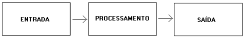

### Introdução à Programação

#### Variáveis, expressões e comandos

**Prof.**: João Paulo Orlando

**Curso**: Bacharelado em Ciência da Computação


#### Variáveis e valores

**Valores**: Valores são informações específicas que um programa manipula. Eles podem ser números, caracteres, strings, booleanos, entre outros tipos de dados. Por exemplo, 5, "Olá, mundo!", 'a', verdadeiro (true) são todos exemplos de valores.

**Variáveis**: Variáveis são espaços de memória reservados para armazenar valores em um programa. Elas possuem um nome único e um tipo de dado associado que determina que tipo de valores podem ser armazenados nelas. As variáveis permitem que os programas armazenem e manipulem dados dinamicamente durante a execução. Por exemplo, em C++, você pode declarar uma variável chamada "idade" para armazenar a idade de uma pessoa.

Agora, vamos falar sobre os tipos básicos de dados em C++:

* Inteiros (`int`): Representam números inteiros, positivos ou negativos, sem casas decimais. Por exemplo: -5, 0, 10.

* Ponto flutuante (`float` e `double`): Representam números com casas decimais. `float` é usado para números de ponto flutuante de precisão simples, enquanto `double` é usado para números de ponto flutuante de precisão dupla. Por exemplo: 3.1415, -0.001, 2.5. **Obs**: É padrão americano, se usa `.` em vez de `,`;

* Caracteres (`char`): Representam caracteres individuais, como letras, números e símbolos. Por exemplo: 'a', 'B', '7', '@'.

* Booleanos (`bool`): Representam valores lógicos verdadeiro (`true`) ou falso (`false`). São usados para controle de fluxo e avaliação de condições. Por exemplo: verdadeiro (`true`), falso (`false`).

* Cadeias de caracteres (`string`): Representam sequências de caracteres. Em C++, as strings são tratadas como um tipo de dados especial, pois possuem várias funções e métodos disponíveis para manipulá-las. Exemplo: "Hello, world!", "C++ é incrível!".

#### Declarando variáveis


**Sintaxe**
```
tipo nome_da_variavel = valor_inicial;

tipo nome_da_variavel;
```

Onde o `tipo` é um dos tipos C++ (como `int`) E `nome_da_variavel` é o nome da variável (como `x` ou `meuNome`). O sinal de igual é usado para atribuir valores à variável.

Exemplo:

``` C++
#include <iostream>
using namespace std;

int main() {
  int meuNum = 15;
  cout << meuNum;
  return 0;
}
```
Você também pode declarar uma variável sem atribuir o valor e atribuir o valor posteriormente:

```C++
#include <iostream>
using namespace std;

int main() {
  int meuNum;
  meuNum = 15;
  cout << meuNum;
  return 0;
}
```

```C++
#include <iostream>
using namespace std;

int main() {
  int idade = 25;
  string nome = "Tiago";
  double salario = 4578.86;
  cout << "Nome: " << nome <<" Idade: "<< idade << " Salário: " << salario;
  return 0;
}
```
 Se você atribuir um novo valor a uma variável existente, ela substituirá o valor anterior:

```C++
#include <iostream>
using namespace std;

int main() {
  int meuNum = 15;   // Agora meuNum é 15
  meuNum = 10;       // Agora meuNum é 10
  cout << meuNum;
  return 0;
}
```

#### Declarando múltiplas variáveis

Para declarar várias variáveis do mesmo tipo é possível fazer uma lista separada por vírgula.

```C++

#include <iostream>
using namespace std;

int main() {
  int x = 5, y = 6, z = 50;  
  cout << x + y + z;
  return 0;
}
```

#### Nomes das variáveis

Todas as variáveis C++ devem ser identificadas com nomes únicos.

Esses nomes são chamados identificadores.

Os Identificadores podem ser nomes curtos (como x e y) ou mais nomes descritivos (idade, soma, volume_total).

**Importante**: Recomenda-se o uso de nomes descritivos para criar um código compreensível e de fácil manutenção.

```C++
int minutos_por_hora = 60;

int m = 60;
```

As regras gerais para os nomes de variáveis são:

* Os nomes podem conter letras, dígitos e sublinhados
* Os nomes devem começar com uma letra ou um sublinhado (_)
* Os nomes são case-sensitive ( `nome` e `Nome` são variáveis diferentes)
* Os nomes não podem conter espaços em branco ou caracteres especiais como !, %, etc.
* Palavras reservadas não pode ser utilizado como nomes: 
```C++
asm       auto      break     case
catch     char      class     const
continue  default   delete    do
double    else      enum      extern
float     for       friend    goto
if        inline    int       long
new       operator  private   protected
public    register  return    short
signed    sizeof    static    struct
switch    template  this      throw
try       typedef   union     unsigned
virtual   void      volatile  while

```

#### Constantes

Uma constante é um valor que não pode ser alterado durante a execução do programa. É um valor fixo e imutável definido no código-fonte e permanece constante ao longo da execução do programa.

 Elas fornecem uma maneira de tornar o código mais legível, evitando o uso de valores literais que podem ser difíceis de entender e manter.

```C++

const int MINUTOS_HORA = 60;
const double TAXA_DE_JUROS = 0.05;
const string NOME_DO_PROGRAMA = "Meu Programa";

```
As constantes proporcionam uma maneira de tornar o código mais claro, facilitando a compreensão do propósito e do funcionamento do programa. 

Elas também ajudam a evitar erros causados por modificações acidentais de valores que não deveriam ser alterados.


#### Exibir variáveis

O objeto `cout` é usado em conjunto com o operador `<<` para exibir variáveis.

Para combinar o texto e uma variável, separe-os com o operador `<<`.

```C++
#include <iostream>
using namespace std;

int main() {
  int idade = 25;
  string nome = "Tiago";
  double salario = 4578.86;
  cout << "Olá, me chamo " << nome 
       << ", tenho "<< idade <<" anos de idade e recebo R$"
       << salario << " de salário.";
  return 0;
}
```

Repare que toda impressão, é feita na mesma linha, isso também acontece, mesmo colocando vários `cout`.
Para inserir uma nova linha devemos colocar o caractere `\n` ou o comando `endl`.

```C++
#include <iostream>
using namespace std;

int main() {
  int idade = 25;
  string nome = "Tiago";
  double salario = 4578.86;
  cout << "Nome: " << nome << '\n';
  cout << "Idade: "<< idade << endl;
  cout << "Salário (R$): " << salario << endl;
  return 0;
}
```

Por enquanto, o que vamos precisar saber, é somente formatar a saída com as variáveis. Vários exercícios irão solicitar isso de vocês.

Entretanto, a formatação possui muitos outros recursos. Fiquem a vontade para estudar mais.



Bom já vimos a saída, agora vamos ver uma forma de passarmos dados para o processamento.


#### `cin`
Faz uma pausa no programa e espera uma entrada do usuário pelo terminal.

`cin` é um objeto usado em conjunto com o operador `>>` para ler dados do teclado 

No próximo exemplo, o usuário pode informar um número inteiro que será armazenado na variável `x`, na sequência o valor de `x` será impresso.

```C++
#include <iostream>
using namespace std;

int main() {
  int x;
  cout << "Informe um valor inteiro: ";
  cin >> x; 
  cout << "O número digitado foi " << x << endl;
  return 0;
}
```

O objeto `cin` funciona com vários tipos de dados:

```C++
#include <iostream>
using namespace std;

int main() {
  int idade;
  string nome;
  double salario;
  
  cout << "Informe o nome: ";
  cin >> nome;
  cout << "Informe a idade de " << nome <<": ";
  cin >> idade;
  cout << "Informe o salário de " << nome << ": ";
  cin >> salario;
  
  cout << "Nome: " << nome << endl;
  cout << "Idade: "<< idade << endl;
  cout << "Salário: " << salario << endl;
  return 0;
}
```

Podemos ler vários valores na mesma linha, separados por espaço.

```C++
#include <iostream>
using namespace std;

int main() {
  int x, y;
  
  cin >> x >> y;
  cout << "A soma de x e y eh " << x+y << endl;
  
  return 0;
}
```


Bom já sabemos fazer a entrada e saída para os nossos problemas agora, vamos começar a processar as informações.

#### Operadores

Um recurso importante e bastante utilizado para isso são os operadores. Eles podem ser de várias categorias: 
* Aritméticos, 
* Atribuição, 
* Lógicos, 
* Comparação, 
* Lógicos bit-a-bit.

Por agora, vamos só focar nos Aritméticos e nos de Atribuição.

**Aritméticos**: Nos ajudam a fazer cálculos matemáticos;

Operador | Operação | Forma
:- | :- | :-
\+ | Soma | x + y
\- | Subtração | x - y
\* | Multiplicação | x \* y
/ | Divisão | x / y
% | Resto da divisão | x % y
++ | Incrementa o valor da variável em 1 | x++
-- | Diminui o valor da variável em 1 | x--

```C++
int x = 5, y = 2;
  
cout << x+y << endl;
cout << x-y << endl;
cout << x*y << endl;
cout << x/y << endl;
cout << 1.0*x/y << endl;
cout << x%y << endl;

x++; // é o mesmo que x = x + 1
y--; // é o mesmo que y = y - 1
cout << x << endl;
cout << y << endl;

```


**Atribuição**: Nos ajudam a armazenar dados e facilmente modificar variáveis em memória;

Operador | Exemplo | Forma estendida
:- | :- | :-
= | x = 5 | x = 5
+= | x += 3 | x = x + 3
-= | x -= 3 | x = x - 3
\*= | x \*= 3 | x = x \* 3
/= | x /= 3 | x = x / 3
%= | x %= 3 | x = x % 3

```C++
int x = 2;
x += 5;
x -= 2;
x *= 3;
x /= 5;
x %= 7;

cout << x << endl;
```

**Prioridades**
```C++
#include <iostream>
using namespace std;

int main() {
    int va = 2;
    int resultado = 2+5*va - va*5+2;
    cout << resultado << endl;
    return 0;
}
/*Vocês conseguem saber qual será o resultado 
  que estará guardado na variável resultado?*/
```
Quando uma expressão contém mais de um operador, a ordem da avaliação depende da ordem das operações. Para operadores matemáticos, o C++ segue a convenção matemática.

* Os Parênteses têm a precedência mais alta e podem ser usados para forçar a avaliação de uma expressão na ordem que você quiser. Como as expressões em parênteses são avaliadas primeiro, `2 * (3-1)` é `4`. Também é possível usar parênteses para facilitar a leitura de uma expressão, como em `(minutos * 100) / 60`, mesmo se o resultado não for alterado.

* A Multiplicação e a Divisão têm precedência mais alta que a Adição e a Subtração. Assim, `2 * 3 - 1` é `5`, não `4`, e `6 + 4 / 2` é `8`, não `5`.

* Os operadores com a mesma precedência são avaliados da esquerda para a direita. Assim, na expressão `graus / 2 * pi`, a divisão acontece primeiro e o resultado é multiplicado por `pi`. Para dividir por `2 * pi`, você pode usar parênteses `graus / (2 * pi)`.

**Dica**: Se a expressão não estiver clara à primeira vista, podem usar parênteses para tornar mais claro.


#### Exercícios

1 - Escreva um programa que leia três números inteiros e imprima sua soma. 

```C++
#include <iostream>

using namespace std;

int main(){
    
    int val1, val2, val3, soma;
    cin >> val1 >> val2 >> val3;
    
    soma = val1 + val2 + val3;
    
    cout << soma << endl;
    
    return 0;
}

```

2 - Escreva um programa que leia um número inteiro e imprima o seu quadrado.

```C++
#include <iostream>

using namespace std;

int main(){
    
    int valor, quadrado;
    cin >> valor;
    
    quadrado = valor * valor;
    
    cout << quadrado << endl;
    
    return 0;
}

```

3 - Escreva um programa que leia o comprimento da base e a altura de um triângulo retângulo a seguir imprima a área.
`area = (base * altura) / 2`

```C++
#include <iostream>

using namespace std;

int main(){
    
    double base, altura, area;
    
    cin >> base >> altura;
    
    area = (base * altura) / 2;
    
    cout << area << endl;
    
    return 0;
}

```

4 - N alunos levam K maçãs e distribuem entre si uniformemente. A parte restante (a não-divisível) permanece na cesta. 
* Quantas maçãs cada aluno terá? 
* Quantas maçãs permanecerão na cesta?

O programa lê os números N e K. Deve imprimir as duas respostas para as perguntas acima.

```C++
#include <iostream>

using namespace std;

int main(){
    
    int macas, pessoas, divisao, resto;
    cin >> macas >> pessoas;
    
    divisao = macas/pessoas;
    resto = macas%pessoas;
    
    cout << divisao << " " << resto << endl;
    
    return 0;
}

```

#### Atividades


#### Plataforma Beecrowd para as listas de exercícios

1 - Todo mundo fazendo o cadastro na plataforma:
[Beecrowd](https://www.beecrowd.com.br/judge/pt/login)


2 - Preencha um e-mail e uma senha que não irá esquecer. 


3 - Receberá um e-mail com a ativação do cadastro. Clique em **ativar**.


4 - Agora você deve estar na página abaixo. Se tiver dificuldades com inglês, mude o idioma da página, já nesse momento, no canto superior esquerdo da página. Depois, na sequência, faça o login no centro da página.


5 - Primeiro passo na Plataforma, para poder acessar todos os recursos é realizar o preenchimento do perfil. Acessem **Perfil**, depois **Configurações**. Preencham todos os campos marcados em vermelho em todos os grupos de dados marcados com uma bolinha vermelha (Lateral esquerda).
**Dica**: marque o mínimo possível de itens, cada item que você marcar a mais, irá abrir novos itens para preenchimento. 


5.a - Alguns itens importantes que devem ser modificados:

* **Linguagem de desenvolvimento preferida para uso na plataforma beecrowd** para **C++20** 
* **Em Educação** adicione o *IFPR-GERAL - Instituto Federal do Paraná*.


6 -  Agora estão prontos para acessar a disciplina, cliquem do botão **Academic** (está no topo da página), cliquem em **Acessar Disciplina**  e digitem os seguintes dados para acessar:

ID Disciplina: **12064**

Chave: **1duIMxs** 

Só precisa fazer isso a primeira vez, depois, sempre estará disponível esse acesso pelo botão **Academic**.


#### Atividade (Já vale nota)

Façam os exercícios da **Lista 2 - Números Inteiros** no [Beecrowd](https://www.beecrowd.com.br/judge/pt/).

**Só relembrando**: Nas listas de exercícios, o sistema de anti-plágio estará ativado, caso identifique alguma suspeita de plágio, convocarei o(s) aluno(s) para realizar uma atividade presencial de resolução e apresentação dos exercícios resolvidos.