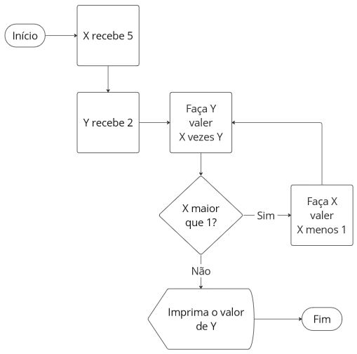

### Introdução à Programação

#### Iterações com for

**Prof.**: João Paulo Orlando

**Curso**: Bacharelado em Ciência da Computação

Realizar tarefas repetitivas sem cometer erros é algo que os computadores fazem bem e as pessoas nem tanto. 


É por isso que os computadores são utilizados muitas vezes para automatizar tarefas do tipo repetitiva.

A execução repetida de uma sequência de instruções é chamada de iteração (iteration) ou Loops. 

Loops (em português "laços de repetição") são estruturas que garantem que uma parte do código seja repetida várias vezes.

Existem duas formas em C++ de criarmos laços de repetições:

* `for`: Quando sabemos exatamente quantas vezes o loop deverá ser executado. Por exemplo, 10 vezes, 1.000.000 de vezes.

* `while` e `do ... while`: Quando não sabemos quantas vezes o loop deverá ser executado. Por exemplo, leia a senha até ela ser correta (pode ser 1 vezes ou centenas de tentativas).


#### Iterações e Loops

Na computação, chamamos de **loop** uma estrutura contendo código que será executado múltiplas vezes. Cada repetição do loop é chamada **iteração**. Vamos a um diagrama que mostra como essa repetição ocorre.



<center> <small> Diagrama gerado em <a href="https://miro.com/app">Miro</a></small> </center>

Em C++, a sintaxe do `for` é:

```
for (statement 1; statement 2; statement 3) {
  // Bloco de código a ser executado a cada iteração.
}
````

* `statement 1` é executado (uma vez) antes da execução do bloco de código.

* `statement 2` define a condição para a execução do bloco de código. Somente executa, o código interno do ´for´, caso seja verdadeira.

* `statement 3` é executado sempre após executar o código interno ter sido executado.

Para exemplificar, vamos construir uma estrutura que imprima a frase "nova iteração" algumas vezes.

```C++
#include <iostream>
using namespace std;

int main() {
  for (int i = 0; i < 5; i++) {
    cout << "Nova iteração!" << endl;
  }
  return 0;
}
```
**Explicação do exemplo**
`int i = 0` define e inicializa uma variável antes do loop ser iniciado.

`i < 5` define a condição para a iteração do loop ser executado (i deve ser menor do que 5). Se a condição `for` verdadeira, uma nova iteração do loop começará, se `for` falso, o loop vai ser encerrado.

`i++` aumenta em um o valor de `i` cada vez que uma iteração do `for` terminar.


Mais um exemplo:

```C++
#include <iostream>
using namespace std;

int main() {
  for (int i = 0; i <= 10; i += 2) {
    cout << i << endl;
  }
  return 0;
}

```

##### Loops aninhados

Também é possível colocar um loop dentro de outro loop. Isso é chamado de loop aninhado.

O "loop interno" será executado uma vez para cada iteração do "loop externo":

```C++
#include <iostream>
using namespace std;

int main() {
  // Loop externo
  for (int i = 1; i <= 2; ++i) {
    cout << "Externo: " << i << endl;  // Executa 2 vezes
    
    // Loop interno
    for (int j = 1; j <= 3; ++j) {
      cout << "   Interno: " << j << endl;  // Executa 6 vezes (2 * 3)
    }
  }
  return 0;
}

```
**Resultado:**
```
Externo: 1
   Interno: 1
   Interno: 2
   Interno: 3
Externo: 2
   Interno: 1
   Interno: 2
   Interno: 3
```
**Exercícios**

1 - Faça um programa que leia dois valores inteiro, o início e fim do for. Após isso classifique todos os valores ENTRE ELES como par ou impar.

```C++

```

2 - Mesmo problema anterior, mas agora com a diferença que não sabemos se 1º ou 2º valor lido será o menor. Então temos que testar a ordem primeiro

1ª solução
```C++

```

2ª solução
```C++

```

3 - Mesmo problema anterior, mas agora com a diferença é que queremos decrescente.

```C++

```
Vamos resolver esse problema: 


```C++

```

Agora podem começar a fazer a **Lista 5 - For**