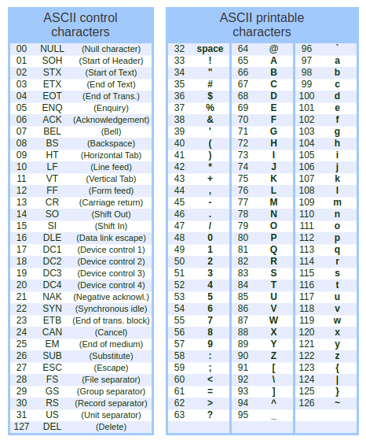

### Introdução à Programação

#### Char e Strings

**Prof.**: João Paulo Orlando

**Curso**: Bacharelado em Ciência da Computação

#### Char

O tipo `char` é um tipo usado para armazenar um único carácter. Um carácter, em C++, é cercado por aspas simples.

```C++
char minha_nota = 'B';
cout << minha_nota << endl;
```

#### Codificação ASCII (American Standard Code for Information Interchange)



Fonte: [Treina Web](https://www.treinaweb.com.br/blog/uma-introducao-a-ascii-e-unicode)

Por exemplo, o 'a' minúsculo que você digita no teclado é representado na tabela pelo decimal 97, mas internamente o computador trabalha isso em binário, ou seja, com 8 bits `01100001` (97 em decimal).

Em C++, podemos usar o decimal para representar a letra.

```C++
char a = 97, b = 98;
cout << a << endl;
cout << b << endl;
```

Precisamos decorar essa tabela?

**NÃO**, podemos fazer até cálculos matemáticos sem saber do código ASCII.

Vamos converter uma letra minúscula em maiúscula, sem saber dos códigos ASCII.

```C++
#include <iostream>
using namespace std;

char converte_minusculo(char letra){
    
    int dif = 'a' - 'A';
    if (letra >= 'A' && letra <= 'Z'){
        return letra+dif;
    }else{
        return letra;
    }
    
}

int main(){
    cout << converte_minusculo('G') << endl;
    cout << converte_minusculo('H') << endl;
    cout << converte_minusculo('e') << endl;
    cout << converte_minusculo('7') << endl;
    return 0;
}
```

**Resultado**
```
g
h
e
7
```

Transformando o carácter númerico em inteiro.

Cuidado com isso!

```C++
char num_char = '7';
int num = num_char;

cout << num_char << " --> " << num << endl;
    
```

**Resultado**
```
7 --> 55
```

Para converte para inteiro precisamos fazer o seguinte cálculo:

```C++
char num_char = '7';
int num = num_char-'0';

cout << num_char << " --> " << num << endl;
```

**Resultado**
```
7 --> 7
```


#### Strings ou Cadeias de caracteres ou Conjunto de caracteres
A manipulação de conjuntos de caracteres (strings) é uma operação muito comum em processamento não numérico. Imagine os programas editores de texto que precisam fazer operações do tipo:
* Procurar uma cadeia de caracteres no texto;
* Eliminar uma cadeia do texto;
* Substituir uma cadeia por outra;
* Contar ocorrências.
A manipulação de caracteres merece uma especial atenção das linguagens de programação.

O tipo, em C++, que representa um conjunto de caracteres é o `string`. Uma string, em C++, é cercado por aspas duplas.

```C++
string nome = "João Paulo";
cout << nome << endl;
```

Para utilizar todos recursos de string, é necessário incluir a biblioteca `<string>`.

#### Concatenação

O operador `+` pode ser usados para concatenar duas strings;

```C++

string firstName = "João";
string lastName = "Orlando";
string fullName = firstName + " " + lastName;
```

Então o operador `+` serve tanto para adição de dois números como para a concatenação. Entretando se usar esse operador entre um inteiro e uma string, um erro é gerado;


Uma string, em C++, é um objeto, que contém funções que podem executar determinadas operações com strings. Uma dessas funções é o `append()` que permite concatenar strings.

```C++
#include <iostream>
#include <string>
using namespace std;
 
int main () {
  string firstName = "João";
  string lastName = "Orlando";
  string fullName = firstName.append(" ").append(lastName);
  cout << fullName << endl;
  return 0;
}

```
Outras funções da classe `string` podem ser concultadas em [cplusplus](https://cplusplus.com/reference/string/string/)


#### Tamanho de uma string

Para ter o tamanho de uma string, é necessário usar a função `length()`:

```C++
#include <iostream>
#include <string>
using namespace std;

int main() {
  string txt = "ABCDEFGHIJKLMNOPQRSTUVWXYZ";
  cout << "O tamanho da string txt é: " << txt.length() << endl;
  return 0;
}
```

Você pode ver alguns programas C++ que usam a função `size()` para obter o comprimento de uma string. Isto é apenas um pseudônimo de `length()`. O uso de ambos é válido.

#### Acessando os caracteres de uma string

O acesso de um carácter é igual ao acesso de um elemento de um array. Você utiliza o índice dentro de colchetes `[]`.
No exemplo abaixo, imprimimos o primeiro carácter de uma string.

```C++
string firstName = "João";
string lastName = "Orlando";
cout << "Iniciais:" << firstName[0] << lastName[0] << endl;
```

#### Mudando um carácter de uma string

Para mudar um carácter específico em uma string, é feito uma atribuição para um deteminado índice da string;

```C++
string nome =  "Joao paulo";
nome[5] = 'P';
cout << nome << endl;

// A saída será: Joao Paulo
```

vamos usar a função anteriormente criada para converter em minúsculo para converter uma string inteira:

```C++
#include <iostream>
#include <string>
using namespace std;

char converte_minusculo(char letra){
    
    int dif = 'a' - 'A';
    if (letra >= 'A' && letra <= 'Z'){
        return letra+dif;
    }else{
        return letra;
    }
    
}

int main() {
  string txt = "ABCDEFGHIJKLMNOPQRSTUVWXYZ";

  for (int i = 0; i < txt.length(); i++){
  	txt[i] = converte_minusculo(txt[i]);
  }
  cout << txt << endl;
  return 0;
}

```
#### Caracteres especiais

Como as strings devem ser escritas dentro das aspas duplas, o C++ não entenderá a string abaixo, e gerar um erro:

```C++
string txt = "We are the so-called "Vikings" from the north.";

```
A solução para evitar esse problema é usar o caráter de contrabarra (`\`).

A contrabarra (`\`) transforma caracteres especiais em caracteres de cadeia de texto;

```C++
string txt = "We are the so-called \"Vikings\" from the north.";
```

Comando | Resultado | Descrição
-|-|-
\\' | ' | Exibe uma aspa simple
\\" | " | Exibe uma Aspa dupla
\\\ | \ | Exibe uma contrabarra

Outros caracteres especiais são:

Comando | Resultado
-|-
\\n | Nova linha
\\t | Tabulação (tab)

#### Leitura de strings

É possível utilizar o operador ``cin >>` para armazenar uma string em uma variável:

```C++
string nome;
cin >> nome;
cout << "O nome digitado foi: " << nome << endl;
```

Entretando, o `cin` considera um espaço(espaço em branco, tab, etc) como separador entre valores:

```C++
string fullName;
cout << "Informe o nome completo: ";
cin >> fullName;
cout << "O seu nome é: " << fullName;

// Informe o nome completo: Joao Orlando 
// O seu nome é: Joao
```
No exemplo acima, esperamos que o programa imprima "Joao Orlando", mas somente será impresso "Joao";

Por isso, que muitas vezes que formos trabalhar com strings, vamos usar o `getline()` para ler uma linha inteira. A string terminará quando tiver uma quebra de linha (Enter).
O `getline()` precisa de dois parâmetros, o primeiro é o `cin` e segunda a variável que receberá a string.

```C++
string fullName;
cout << "Informe o nome completo: ";
getline(cin, fullName);
cout << "O seu nome é: " << fullName;

// Informe o nome completo: Joao Paulo Orlando 
// O seu nome é: Joao Paulo Orlando
```

Vamos ver uma solução para o problema [2753 - Saída 7](https://judge.beecrowd.com/pt/problems/view/2753)

```C++
#include <iostream>
#include <string>
using namespace std;

int main(){
    for (char letra = 'a'; letra <= 'z'; letra++){
        cout << (int)letra << " e " << letra << endl;
    }

    return 0;
}
```

O comando `(int)letra` está fazendo a convesão do carácter para a sua codificação ASCII;


Vamos resolver o problema [1253 - Cifra de César](https://judge.beecrowd.com/pt/problems/view/1253)

```C++

#include <iostream>
using namespace std;

int main(){
    int testes, deslocamento;
    string texto;
    
    cin >> testes;
    for (int i = 0; i < testes; i++){
        cin >> texto;
        cin >> deslocamento;
        for (int j = 0; j < texto.size(); j++){
            
            if (texto[j] - deslocamento < 'A'){
                texto[j] = 'Z'-('A'-(texto[j]-deslocamento)-1);
            }else{
                texto[j] = texto[j]-deslocamento;
            }
        }
        cout << texto << endl;
    }
    return 0;
}
```


Faltou falar do getchar()


